# <div align="center">🧠 AI Document Processing Suite</div>

<div align="center">
  
  
  
  <br/>
  
  [](https://python.org)
  [](https://pytorch.org)
  [](https://langchain.com)
  [](LICENSE)
  
  <br/>
  
  [](https://github.com/ShamsRupak/ai-doc-processing-suite/stargazers)
  [](https://github.com/ShamsRupak/ai-doc-processing-suite/network/members)
  [](https://github.com/ShamsRupak/ai-doc-processing-suite/issues)
  
  <br/>
  
  
  
  <h3>🚀 Transform Your Documents into Intelligent, Queryable Knowledge</h3>
  
</div>

---

## 📋 Table of Contents

<details open>
<summary><b>Click to Navigate</b></summary>

- [✨ Features](#-features)
- [🎯 Use Cases](#-use-cases)
- [🏗️ Architecture](#️-architecture)
- [🚀 Quick Start](#-quick-start)
- [📊 Performance](#-performance)
- [🛠️ Tech Stack](#️-tech-stack)
- [📁 Project Structure](#-project-structure)
- [💻 Usage Examples](#-usage-examples)
- [🔧 Configuration](#-configuration)
- [📈 Benchmarks](#-benchmarks)
- [🤝 Contributing](#-contributing)
- [📄 License](#-license)

</details>

---

## ✨ Features

<div align="center">
  
| Feature | Description | Status |
|---------|-------------|--------|
| 🔍 **Smart OCR** | Extract text from scanned PDFs with 98%+ accuracy | ✅ Ready |
| 📑 **Auto Classification** | Categorize documents using AI-powered analysis | ✅ Ready |
| 🧠 **RAG Pipeline** | Answer questions using document context | ✅ Ready |
| 📊 **Multi-Model Support** | Compare TinyLlama, Phi-2, Mistral performance | ✅ Ready |
| 🚄 **Optimized Processing** | GPU-accelerated with batch processing | ✅ Ready |
| 🔐 **Secure Handling** | PII detection and redaction capabilities | 🚧 Coming |

</div>

### 🎬 Demo

<div align="center">
  
</div>

---

## 🎯 Use Cases

<details>
<summary><b>🏦 Financial Services</b></summary>

- **Mortgage Processing**: Extract key terms from loan documents
- **Contract Analysis**: Identify important clauses and conditions
- **Compliance Checking**: Ensure documents meet regulatory requirements

</details>

<details>
<summary><b>📋 Legal Operations</b></summary>

- **Document Discovery**: Search through large document sets
- **Contract Review**: Extract and analyze key terms
- **Due Diligence**: Automated document verification

</details>

<details>
<summary><b>🏢 Enterprise Solutions</b></summary>

- **Invoice Processing**: Extract line items and totals
- **Report Generation**: Summarize lengthy documents
- **Knowledge Management**: Build searchable document repositories

</details>

---

## 🏗️ Architecture

```mermaid
graph LR
    A[📄 PDF Input] --> B[🔍 OCR Engine]
    B --> C[📑 Classifier]
    C --> D[🧩 Chunking]
    D --> E[🔢 Embeddings]
    E --> F[💾 Vector Store]
    F --> G[🤖 LLM + RAG]
    G --> H[💬 Answer]
    
    style A fill:#e1f5fe
    style H fill:#c8e6c9
```


---

## 🚀 Quick Start

### Prerequisites

<div align="center">

| Requirement | Version |
|-------------|---------|
| Python | 3.8+ |
| CUDA | 11.8+ (for GPU) |
| RAM | 8GB minimum |
| Storage | 10GB free |

</div>

### 🔧 Installation

```bash
# Clone the repository
git clone https://github.com/ShamsRupak/ai-doc-processing-suite.git
cd ai-doc-processing-suite

# Create virtual environment
python -m venv venv
source venv/bin/activate  # On Windows: venv\Scripts\activate

# Install dependencies
pip install -r requirements.txt

# Download models
python scripts/download_models.py
```

### 🎮 Quick Demo

```python
from doc_processor import DocumentPipeline

# Initialize pipeline
pipeline = DocumentPipeline(model="tinyllama")

# Process document
result = pipeline.process("data/sample_loan.pdf")

# Query the document
answer = pipeline.query("What is the interest rate?")
print(f"Answer: {answer}")
```

---

## 📊 Performance

<div align="center">

### ⚡ Processing Speed

| Document Type | Pages | Processing Time | Accuracy |
|--------------|-------|-----------------|----------|
| Loan Agreement | 10 | 2.3s | 98.5% |
| Bank Statement | 5 | 1.1s | 99.2% |
| Contract | 15 | 3.5s | 97.8% |

### 🧠 Model Comparison


</div>

---

## 🛠️ Tech Stack

<div align="center">

| Category | Technologies |
|----------|-------------|
| **Core Framework** |   |
| **OCR & Extraction** |   |
| **NLP & RAG** |   |
| **Models** |   |

</div>

---

## 📁 Project Structure

```
📦 ai-doc-processing-suite/
├── 📂 src/
│   ├── 🔍 ocr/
│   │   ├── extract_text.py
│   │   └── preprocess.py
│   ├── 📑 classification/
│   │   ├── classifier.py
│   │   └── models.py
│   ├── 🧠 retrieval/
│   │   ├── rag_pipeline.py
│   │   ├── embeddings.py
│   │   └── vector_store.py
│   └── 🤖 llm/
│       ├── model_loader.py
│       └── prompts.py
├── 📂 data/
│   ├── sample_loan.pdf
│   ├── bank_statement.pdf
│   └── contract.pdf
├── 📂 tests/
├── 📂 notebooks/
│   └── demo.ipynb
├── 📋 requirements.txt
├── 🔧 config.yaml
└── 📖 README.md
```

---

## 💻 Usage Examples

### 📄 Basic Document Processing

<details>
<summary><b>Click to expand code example</b></summary>

```python
from src.ocr import extract_text
from src.classification import DocumentClassifier
from src.retrieval import RAGPipeline

# Extract text from PDF
text = extract_text("path/to/document.pdf")

# Classify document
classifier = DocumentClassifier()
doc_type = classifier.classify(text)
print(f"Document type: {doc_type}")

# Setup RAG pipeline
rag = RAGPipeline(model="tinyllama")
rag.add_document(text, metadata={"type": doc_type})

# Query document
response = rag.query("What are the key terms?")
print(response)
```

</details>

### 🔍 Advanced Queries

<details>
<summary><b>Click to expand code example</b></summary>

```python
# Complex multi-document analysis
pipeline = DocumentPipeline(
    model="mistral-7b",
    chunk_size=512,
    overlap=128
)

# Process multiple documents
documents = [
    "loan_agreement.pdf",
    "property_appraisal.pdf",
    "income_verification.pdf"
]

for doc in documents:
    pipeline.add_document(doc)

# Cross-document queries
questions = [
    "What is the total loan amount?",
    "Compare the appraised value with the loan amount",
    "Verify the borrower's income"
]

for q in questions:
    answer = pipeline.query(q)
    print(f"Q: {q}\nA: {answer}\n")
```

</details>

---

## 🔧 Configuration

Create a `config.yaml` file:

```yaml
# Model Configuration
model:
  name: "tinyllama"
  quantization: "8bit"
  max_tokens: 512

# OCR Settings
ocr:
  engine: "tesseract"
  language: "eng"
  dpi: 300

# RAG Configuration
rag:
  chunk_size: 512
  chunk_overlap: 128
  retriever_k: 5
  
# Performance
performance:
  batch_size: 32
  use_gpu: true
  cache_embeddings: true
```

---

## 📈 Benchmarks

<div align="center">

### 🏆 Model Performance Comparison

| Model | Accuracy | Speed (docs/min) | Memory (GB) | Cost |
|-------|----------|------------------|-------------|------|
| TinyLlama 1.1B | 85% | 45 | 2.5 | Free |
| Phi-2 2.7B | 92% | 30 | 4.0 | Free |
| Mistral 7B | 96% | 15 | 8.0 | Free |
| GPT-3.5 | 98% | 60 | API | $$$ |

</div>

---

## 🤝 Contributing

We love contributions! Please see our [Contributing Guide](CONTRIBUTING.md) for details.

<div align="center">

### 👥 Contributors

<a href="https://github.com/ShamsRupak/ai-doc-processing-suite/graphs/contributors">
  
</a>

</div>

---

## 📄 License

This project is licensed under the MIT License - see the [LICENSE](LICENSE) file for details.

---

<div align="center">
  
### ⭐ Star History

[](https://star-history.com/#ShamsRupak/ai-doc-processing-suite&Date)

<br/>

### 🙏 Acknowledgments

Built with ❤️ using amazing open-source tools and libraries.

<br/>


<br/>

**[⬆ back to top](#-table-of-contents)**

</div>
